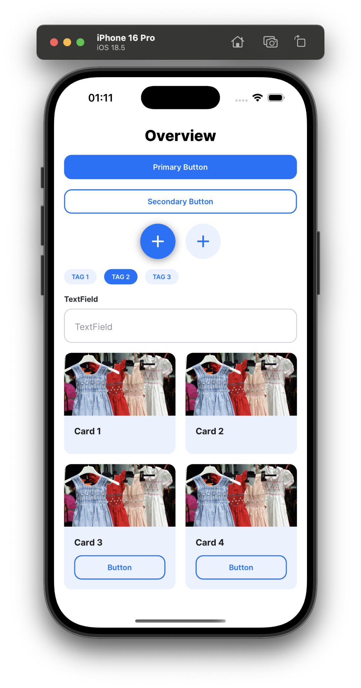
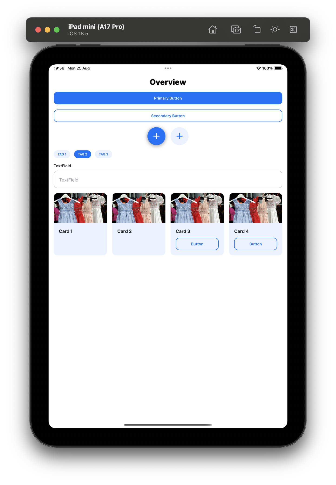

# Cross Assignment 3 - Components Documentation

This document provides a comprehensive overview of all UI components available in the Cross Assignment 3 React Native project.

## 🧩 Components

The project includes the following reusable components:

### Core Components

- **Button** - Primary and secondary button variants
- **Card** - Image card with optional button
- **CardsGrid** - n-column grid layout for cards
- **Fab** - Floating Action Button with icon support
- **Tag** - Individual tag component
- **Tags** - Horizontal tag list with selection
- **TextField** - Input field with label

### Specialized Components

- **OutfitCard** - Horizontal scrollable card for displaying outfit items with edit functionality
- **OutfitsGrid** - Vertical list layout for displaying multiple outfit cards
- **DeleteButton** - Icon button with confirmation dialog for delete actions
- **ErrorView** - Error state display with retry functionality
- **EmptyView** - Empty state display with customizable image and text
- **LoadingView** - Loading state with activity indicator

### Helper Utilities

- **useDeviceKind** - Hook for responsive design with device type detection (phone/tablet/desktop)
- **requireImage** - Utility for safe image asset loading with error handling

## 📱 Component Screenshots

**Phone View:**


**Tablet View:**


## 🎨 Design System

The project uses a centralized design system with:

- Consistent color palette
- Typography scale
- Spacing system
- Component variants

## 📁 Component Structure

```text
components/
├── Button.tsx              # Primary and secondary button variants
├── Card.tsx                # Image card with optional button
├── CardsGrid.tsx           # n-column grid layout for cards
├── DeleteButton.tsx        # Icon button with confirmation dialog
├── EmptyView.tsx           # Empty state display
├── ErrorView.tsx           # Error state display
├── Fab.tsx                 # Floating Action Button
├── LoadingView.tsx         # Loading state component
├── OutfitCard.tsx          # Horizontal scrollable outfit card
├── OutfitsGrid.tsx         # Vertical list of outfit cards
├── Tag.tsx                 # Individual tag component
├── Tags.tsx                # Horizontal tag list
├── TextField.tsx           # Input field with label
├── helpers/                # Helper utilities
│   ├── requireImage.ts     # Safe image asset loading
│   └── useDeviceKind.ts    # Device type detection hook
└── index.ts                # Component exports
```
