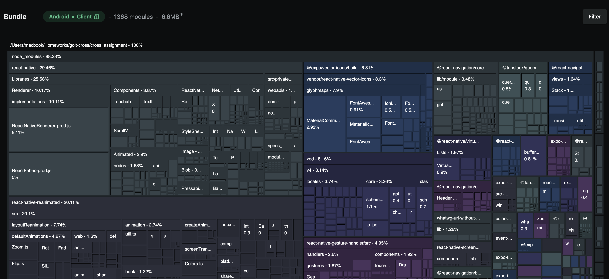
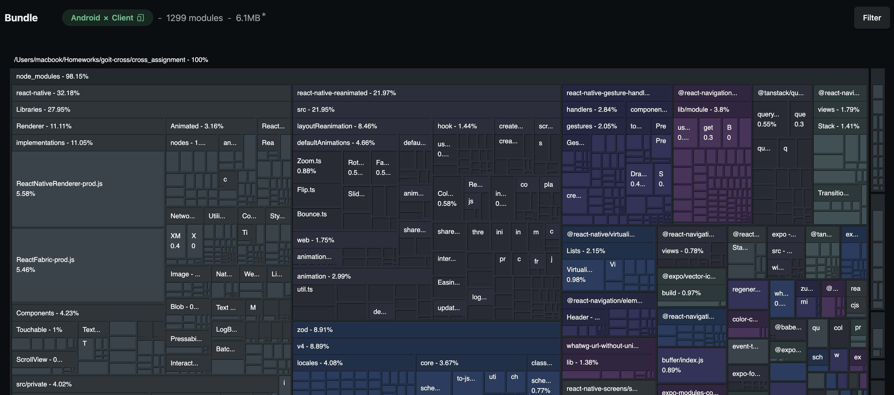

# Performance Optimization Analysis

## Overview

This document analyzes the application for performance optimization opportunities, focusing on animation implementation, re-render optimization, and bundle analysis.

## Task 1: Animation Opportunities

### Components That Could Benefit from Animations

After analyzing the application, several components would benefit from animations:

1. **Floating Action Button (Fab)** - Could use entrance/exit animations and press feedback
2. **OutfitCard horizontal scroll** - Smooth scroll animations and card transitions
3. **Theme switching** - Smooth color transitions across the app
4. **Navigation transitions** - Screen-to-screen animations
5. **Loading states** - Skeleton animations and fade transitions

### Selected Component: Floating Action Button (Fab)

**Why Fab?**

- Most prominent interactive element in the app
- Appears on multiple screens (Wardrobe, Outfits)
- Would benefit from both entrance animations and press feedback
- High visual impact with minimal implementation complexity

**Animation Requirements:**

- Entrance animation when screen loads
- Press feedback animation (scale/ripple effect)
- Optional: exit animation when navigating away

### Animation Library Choice: React Native Reanimated

**Why Reanimated over Layout Animator?**

✅ **Better Performance** - Runs on UI thread, no bridge communication  
✅ **More Control** - Granular control over animation timing and easing  
✅ **Complex Animations** - Better suited for gesture-driven animations  
✅ **Press Feedback** - Perfect for Fab press interactions  
✅ **Bundle Size** - Smaller footprint than Layout Animator

**Reanimated is better for:**

- Interactive press animations
- Complex gesture handling
- Performance-critical animations
- Custom easing and timing

**Layout Animator would be better for:**

- List item insertions/deletions
- Automatic layout animations
- Simpler setup for basic transitions


## Task 2: Re-render Optimization

### Components with Potential Re-render Issues

1. **CardsGrid** - Re-renders when device type changes or theme switches
2. **OutfitsGrid** - Re-renders on data changes and theme updates
3. **SettingsScreen** - Theme context changes trigger re-renders
4. **WardrobeContent/OutfitsContent** - API data changes cause re-renders
5. **ThemeProvider consumers** - All components re-render on theme changes

### Selected Component: CardsGrid

**Why CardsGrid?**

- Most complex rendering logic with dynamic columns
- Uses multiple hooks (useDeviceKind, theme colors)
- Renders large lists of items
- Performance impact affects main user experience

**Current Issues:**

```typescript
// CardsGrid.tsx - Potential re-render causes
export const CardsGrid = forwardRef<FlatList, CardsGridProps>(({ cards, columns }, ref) => {
  const { isTablet, isDesktop } = useDeviceKind(); // Re-renders on device change
  const resolvedColumns = columns ?? (isTablet ? 4 : isDesktop ? 6 : 2);

  const renderItem = ({ item }: { item: CardItem }) => ( // New function on every render
    <View style={[styles.cardWrapper, { flex: 1 / resolvedColumns }]}>
      <Card key={item.id} {...item} />
    </View>
  );

  return (
    <FlatList
      key={`grid-${resolvedColumns}`} // Forces full re-render on column change
      renderItem={renderItem} // New function reference every time
      // ...
    />
  );
});
```

**Optimization Strategy:**

1. **Memoize renderItem function** with useCallback
2. **Memoize resolved columns** with useMemo
3. **Optimize key prop** to prevent unnecessary re-renders
4. **React.memo** for Card components

## Task 3: Bundle Analysis

### Bundle Size Analysis (Atlas)

**Before optimization**: 6.6 MB


**After optimization**: 6.1 MB


**Largest Dependencies Identified:**

1. **Font Assets**
   - `@expo-google-fonts/inter` - Inter font family with multiple weights
   - Includes: Regular, SemiBold, Bold, ExtraBold variants

2. **Vector Icons**
   - `@expo/vector-icons` - Multiple icon sets loaded
   - Includes: Ionicons, MaterialIcons, FontAwesome, etc.
   - Largest: MaterialCommunityIcons, Ionicons

3. **Core Dependencies**
   - `@tanstack/react-query` - Data fetching library
   - `@react-navigation/*` - Navigation components
   - `react-native-gesture-handler` - Gesture handling
   - `zod` - Schema validation

### Package Optimization Opportunity

- **Selected Package: `react-native-uuid`**
- **Icon & Fonts**: Removed unused icons and fonts
