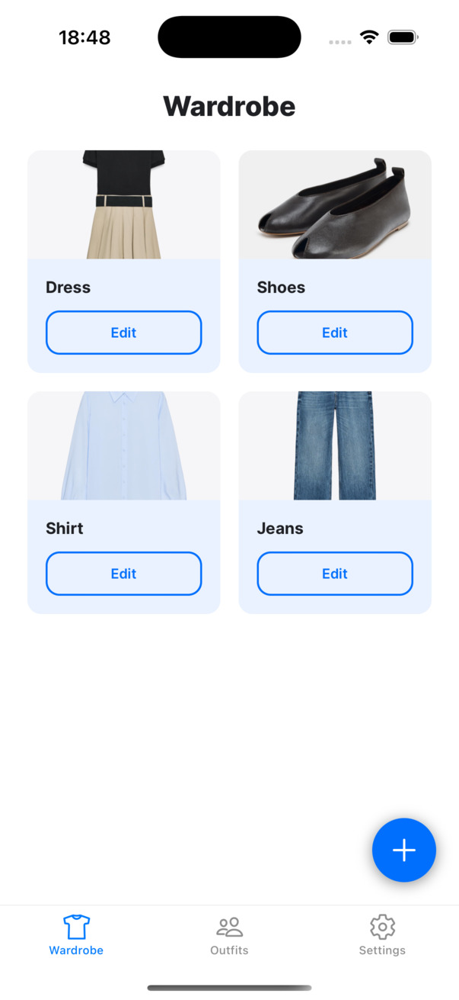
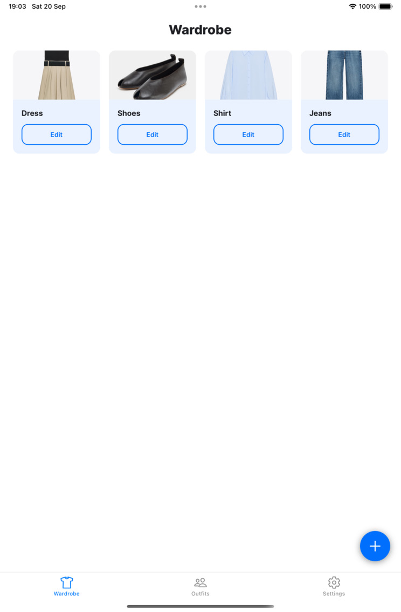
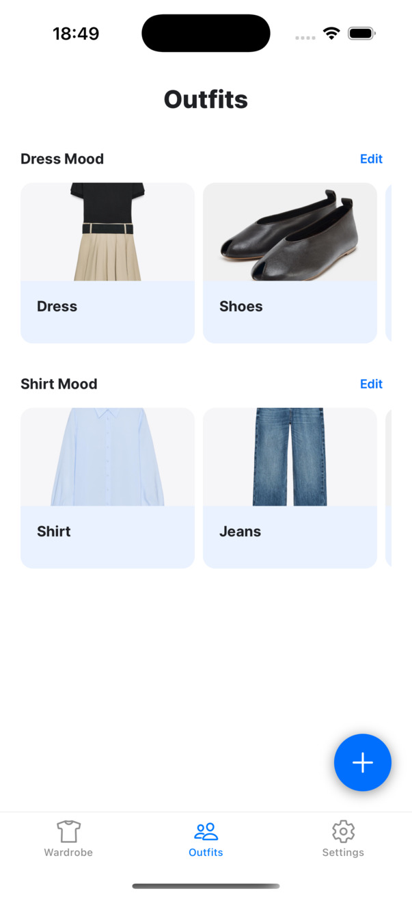
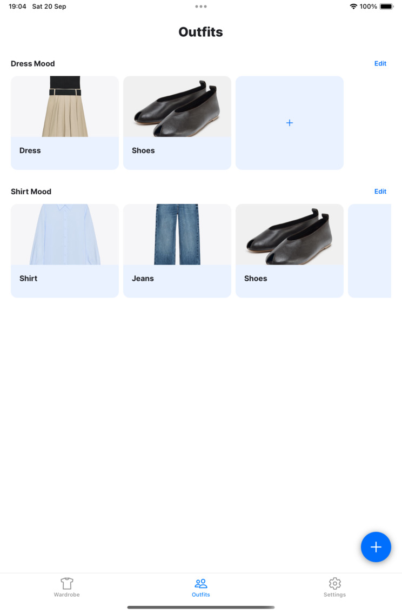
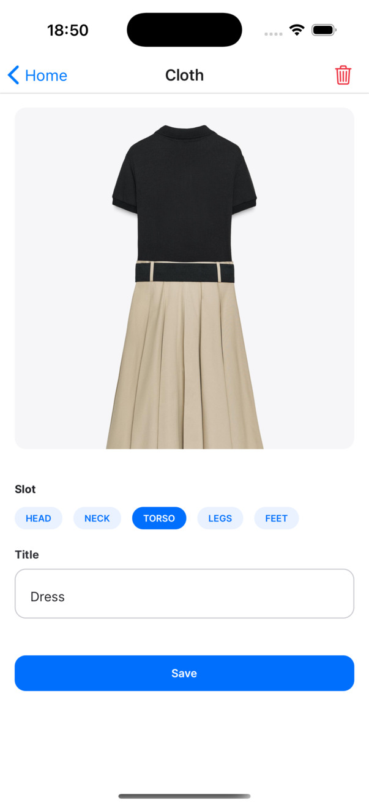
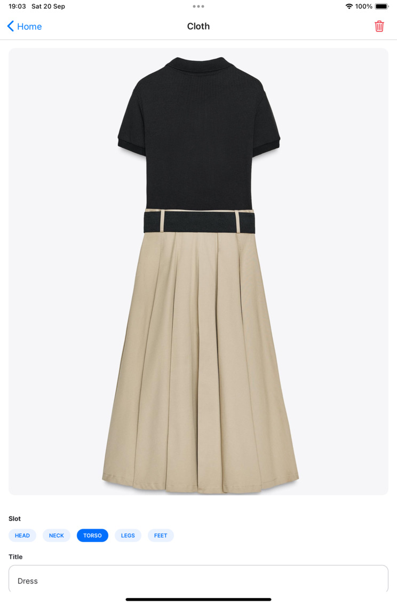
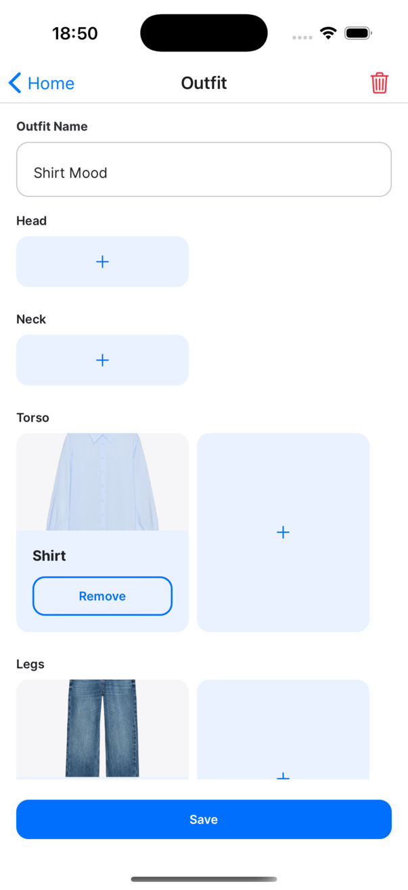
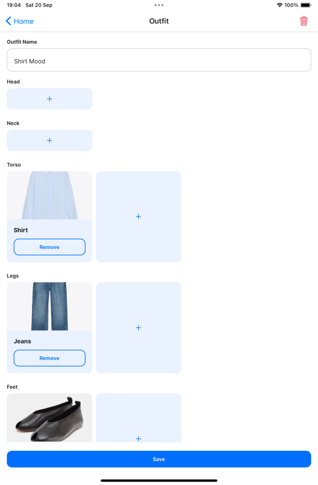
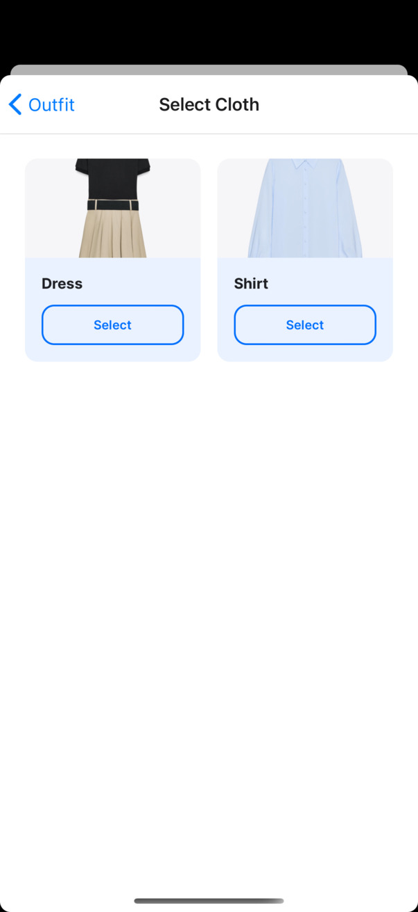
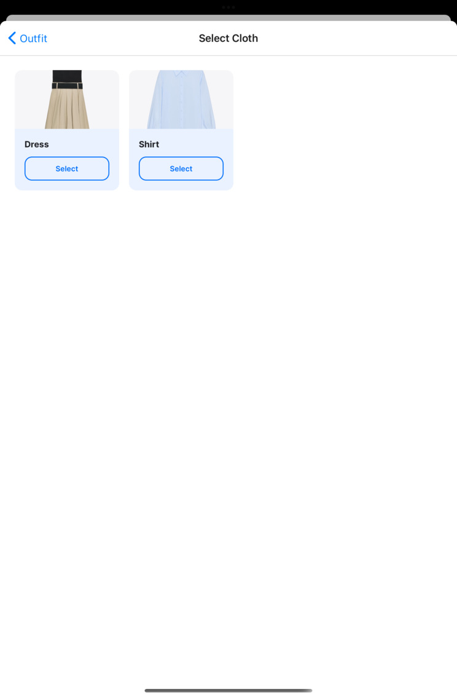

# StyleSnap - Презентація застосунку

---

## Основна ідея

**StyleSnap** — це мобільний застосунок для управління гардеробом та створення образів.

**Мета:** Зробити управління одягом та складання образів простим та приємним процесом.

---

## Ключові функції

### 📱 Управління гардеробом

- Додавання одягу з фотографіями
- Організація за категоріями (голова, шия, торс, ноги, стопи)
- Редагування та видалення елементів

### 👔 Створення образів

- Візуальне складання образів по слотах
- Збереження та редагування готових образів
- Швидкий вибір одягу для конкретного слота

### 🎨 Адаптивний інтерфейс

- Оптимізація для телефонів та планшетів
- Темна/світла тема
- Інтуїтивна навігація

---

| Екран            | Телефон                                                | Планшет                                                 |
| ---------------- | ------------------------------------------------------ | ------------------------------------------------------- |
| Гардероб         |   |   |
| Образи           |      |      |
| Деталі одягу     |        |        |
| Редактор образів |     |     |
| Вибір одягу      |  |  |

---

## Структура застосунку

### Навігація

```text
Tab Navigator (основні розділи)
├── Гардероб
├── Образи
└── Налаштування

Stack Navigator (деталі)
├── Деталі одягу
├── Редактор образів
└── Вибір одягу (модальне вікно)
```

### Архітектура даних

- **TanStack Query** — кешування та синхронізація з API
- **Zod** — валідація даних
- **Context API** — управління темою

---

## Зручність використання

### 🚀 Швидкий доступ

- Модальне вікно для вибору одягу не засмічує навігацію
- Фільтрація за слотами на сервері
- Уніфікована Floating Action Button для швидкого додавання нового одягу чи образу

### 📱 Адаптивність

- Автоматичне налаштування кількості колонок залежно від пристрою
- Оптимізовані розміри карток для різних екранів
- Консистентний дизайн на всіх платформах

### 🎯 Інтуїтивність

- Зрозумілі іконки та мітки
- Логічна послідовність дій
- Зворотний зв'язок при помилках

---

## Результат

**StyleSnap** перетворює простий гардероб у повноцінний інструмент для стилістики, роблячи процес створення образів швидким, зручним та приємним.

- ✅ Повний цикл створення образів
- ✅ Адаптивний дизайн для всіх пристроїв
- ✅ Типізована архітектура з React Native
- ✅ Оптимізована навігація та UX
